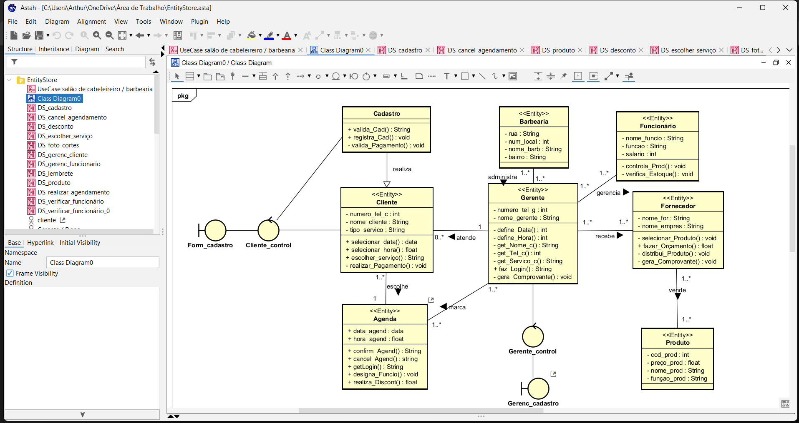

# 💈 Modelagem de Sistema: Gestão de Barbearia

Este diretório contém os artefatos de Engenharia de Requisitos e Modelagem UML desenvolvidos para mapear o fluxo operacional e administrativo de uma Barbearia / Salão de Beleza.

## 🎯 Objetivo do Projeto
Traduzir regras de negócio do mundo real (como agendamentos, controle de comissões, vendas e reposição de estoque) em especificações de arquitetura de software, garantindo a consistência lógica antes da etapa de desenvolvimento.

---

## 🗺️ Escopo e Arquitetura do Sistema (UML)

O sistema foi projetado sob três perspectivas essenciais para garantir uma cobertura completa do negócio:

1. **Análise de Escopo (Diagrama de Casos de Uso):** Delimitação das fronteiras do sistema e níveis de acesso baseados nos atores principais (`Cliente`, `Funcionário`, `Gerente/Dono` e `Fornecedor`), cobrindo fluxos desde o agendamento básico até a gestão estratégica.
2. **Modelo de Domínio (Diagrama de Classes):** Estruturação das entidades lógicas do sistema, mapeando seus atributos essenciais, métodos de ação e o estabelecimento estrito de relacionamentos e multiplicidades.
3. **Dinâmica Comportamental (Diagramas de Sequência):** Detalhamento da troca de mensagens e da ordem cronológica de eventos para cada caso de uso crítico do estabelecimento.

Visualização geral da modelagem estrutural do sistema e organização do projeto:

---

## 📁 Artefatos Disponíveis

* 🖼️ **[`Diagrama de Classes - ProjetoBarb.png`](./Diagrama%20de%20Classes%20-%20ProjetoBarb.png)**: Visão macro da modelagem e da árvore estrutural de diagramas.
* 💾 **[`EntityStore2.asta`](./EntityStore2.asta)**: Arquivo nativo do Astah UML contendo todas as interações e fluxos secundários totalmente navegáveis.

> 💡 *Nota: Projeto acadêmico desenvolvido sob as diretrizes de Engenharia de Software da UTFPR - Campus Cornélio Procópio.*
